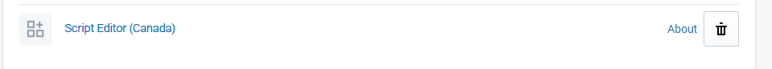

This guide assumes you have access to the Shopify script editor which comes with Shopify Plus.



First we'll initialize the customer in the ruby source code:

```ruby
customer = Input.cart.customer
```

Then we'll want to make the function that applies the discount based on the passed parameter

```ruby
def applyDiscount (message, discountAmount)
```

In the function we'll loop through each line item in the cart and apply the discount by multiplying the line item price by the discount amount

```ruby
Input.cart.line_items.each do |line_item|
line_item.change_line_price(line_item.line_price * discountAmount, message: "#{message}")
end
```

If we wanted the tag discount to only apply on certain products we can wrap the condition with an if statement

```ruby
Input.cart.line_items.each do |line_item|
product = line_item.variant.product.product_type
if product == "Test"
line_item.change_line_price(line_item.line_price * discountAmount, message: "#{message}")
end
end
```

Now that the function is defined we'll need to determine with the customer is logged in

```ruby
if customer
```

Now we'll check for the specific tag that we are looking for

```ruby
if customer
  if customer.tags.include?("TestDiscount")
  #apply discount on TestDiscount tag for 50% on products
  applyDiscount "Test Discount Applied", 0.5
  end
end
```

And that's it! The test discount will apply 50% to all products if the tag is present on the customer logged in.
To avoid overlapping with discount codes inputted you will need to check if the discount code is null or not first.

Done.

End State below:


